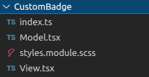

# Concepts

Here you can find all architectural concepts of this project.

## Security

This frontend NextJS stack has got a security layer on top of the layout. The `SecurityWrapper` encapsulate all the app, and here you can customize different things : 

* The routes security, via the `appRoutesRole` file. It associates every route with an array of roles. If the `sessionStorage` token does not have at least one of the specified roles, a redirect to logout is performed.

* The `checkIsLoggedin` function triggers every time the pathname changes. This function checks if the `JWT` expiration date is soon to be reached. If so, a refresh call is made, and with it the user's session refresh.

```typescript
checkIsLoggedIn().then((res: any) => {
    if (res.response && res.response.status && res?.response?.status == 401) {
        router.push('/logout')
        setAuthenticated(false)
    } else {
        setCheckLoginSuccess(true)
        if (!unsecuredRoutes.includes(router.pathname)) {
            setIsInOpenPage(false)
        } else {
            setIsInOpenPage(true)
        }

        checkRoles()
        setAuthenticated(true)
    }
}).catch((error) => {
    setAuthenticated(false)
    if (error?.response?.status == 401) {
        router.push('/logout')
    }
    userDisconnect()
})
```

Many variables are in play here : 

* `authenticated`, a current state determining if the checkIsLoggedIn returned successfuly

* `isInOpenPage`, a current state made to switch to a different page layout if necessary (like the example login page)

* `isValidRole` determines if the current pathname can be reached with the current user's role

* `isPreProcessing`, for an intermediary process (post login, pre Home)

```typescript
    const [authenticated, setAuthenticated] = useState(false)
    const [isValidRole, setIsValidRole] = useState<null | boolean>(null)
    const [isInOpenPage, setIsInOpenPage] = useState(false)
    const [checkLoginSuccess, setCheckLoginSuccess] = useState(false)
```

## HTTP requests

Every single external call in this stack passes through the `httpWrapper`. It's purpose is to create an `axios` instance of the call, put all the necessary header's options, make the call and return the Promise.

Here's a list of the parameters : 

* `method`: current call method (POST, PUT...)

* `data`: an object of data to be serialized in the call

* `isSecured`: a boolean to know if a jwt is necessary

* `url`: call URL

* `isListing`: to know if you want a classic json response or a json+ld response for pagination

```typescript
    let refreshRequest: any = await refreshJwtToken()
    if (refreshRequest.status === 200) {
        headers.Authorization = 'Bearer ' + refreshRequest.data.token
        let res = await makeCall(url, method, headers, data, params, customHost, responseType)

        resolve(res)
    } else {
        reject('Problem refresh JWT')
    }
```

You can split this wrapper in two distinct sections : the headers and options layer, who will process all the parameters to ready the call, and the makeCall function, who's job is to ... make the call !

Another thing, the `refreshToken` method is called when the JWT's expiration date is reached, automatically refreshing the user session's JWT and making the right call juste after.

## Middlewares and Reducers

Redux is built in this project, so you can use its features everywhere on the app. Nothing out of the ordinary here, you can go to the [redux documentation](https://react-redux.js.org/introduction/getting-started) if you want more details.

Although you absolutely can use these tools like you want to, I should note here that there is a single way to use Redux on this stack :

1. dispatch the call

2. grab the type inside the corresponding middleware and make the call

3. get the result and format it in the corresponding reducer if necessary


```typescript
/** Middleware **/

switch (action.type) {
    case types.SET_SPECIFIC_ABOVE_OBJECT: {
        store.dispatch(createSideblockHistory(action.object, action.isHistory))
        next(action)
        break
    }
    case types.GET_ADDRESS_API: {
        const finalAddress = action.address.split(' ').join('+')
        
        try {
            let res = await getAddressApi(finalAddress)
            action.result = res
            next(action)
        } catch (error) {
            store.dispatch(addSnack({
                type: 'error',
                label: t('Generic_Error'),
                id: Date.now(),
            }))
        }

        break
    }
    default:
        next(action)
}
```

```typescript
/** Reducer **/

case types.SET_SPECIFIC_ABOVE_OBJECT:
    return {
    ...state,
    currentDetailsAboveObject: action.object,
    triggerSpecificAboveObject: true
    } as State
```

> ⚠️ Try your best to not format any response inside the middleware

## Containers

Every page and components is `containerized` in this stack. What this means is that instead of calling directly a component to do its render, we call a container, which is calling the component.

The container (`index.ts` for most cases) contains the `mapStateToProps` and `mapDispatchToProps` functions, linking the reducers and middlewares directly to the components.


```typescript
/** container **/

// eslint-disable-next-line no-unused-vars
const mapStateToProps = (state: any) => ({
  isLoggedIn: state.security.isLoggedIn
});

// eslint-disable-next-line no-unused-vars
const mapDispatchToProps = (dispatch: any) => ({
  userDisconnect: () => {
    dispatch(userDisconnect())
  }
});

export default connect(
  mapStateToProps,
  mapDispatchToProps,
)(ViewModel);
```

It prevents props drilling, makes development easier and clearer... 

> ⚠️ Try not to import actions or reducer variables directly in the components !

## Rendering

The last phase is rendering. We applied a MVC method to this stack render. Every single component is composed of four files:

* `index`: the component's container, explained just above

* `Model`: connected to the container, retreive all the redux functions, variables and the passed props. It also formats every data that needs to be formatted, contains the hooks, memos, callbacks and states to be passed to the view

* `View`: the component's static render. Contains only the rendering variables passed by the model

* `Styles`: sass module linked directly to the component.



You can automatically generate your components (creating four files is sometimes tedious, mostly if you have multiple child components to be contained). So we added a custom CLI generating components with all the structure already done. 

To do that, go to your source folder and execute :

```bash
npm run createComponent <your_component_name>
```

> ❔ For docker users, you can connect to your docker container with `docker-compose exec owlnextjs bash` and execute the same command.
